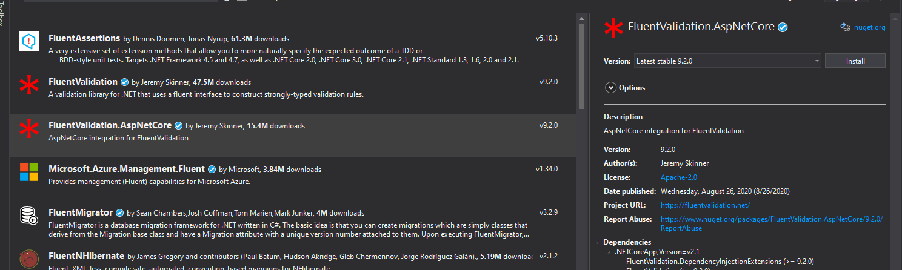

Fluent Validation

|Why do we need to validate the data?

Validation of the user’s input is essential while developing a web API. Suppose a user is sending a JSON payload to the web API, and the payload contains information such as a Person’s name, Date of Birth, Phone number, and the email, we need to validate these data so that we don’t have garbage values in our Database. The Person’s name should be validated to have the null values or a single letter. Similarly, the phone number should be validated to have only numerical values, and the date of birth should be within a range (maybe we can support Person up to 150 years old!).

|Creating a demo application

First, let us start with the creation of our basic project-
Create a project of type – ASP .Net Core Web App.
 
 

Select API while creating the application.

 

This will auto-create a class WeatherForecast.cs with a below class.
namespace FluentDataValidation
{
    public class WeatherForecast
    {
        public DateTime Date { get; set; }

        public int TemperatureC { get; set; }

        public int TemperatureF => 32 + (int)(TemperatureC / 0.5556);

        public string Summary { get; set; }
    }
}

It has also auto-created a GET method for us.

        public IEnumerable<WeatherForecast> Get()
        {
            var rng = new Random();
            return Enumerable.Range(1, 5).Select(index => new WeatherForecast
            {
                Date = DateTime.Now.AddDays(index),
                TemperatureC = rng.Next(-20, 55),
                Summary = Summaries[rng.Next(Summaries.Length)]
            })
            .ToArray();
        }
    }

When launched, it displays as below-

 
|Adding the Fluent Validation reference

In NuGet package manager, search and install FluentValidation AspNetCore package as shown below-
 
  

|Implementing the validator
Add a folder Validator (it’s a choice to add a folder. It makes a clean code!) and add a class file – WeatherForecastValidator.cs

 

The actual code starts from here -
WeatherForecast class needs to be inherited from the FluentValidation’s  AbstractValidator<WeatherForecast>. Next, create a constructor and start adding the rules for each data as below-

namespace FluentDataValidation.Validator
{
    public class WeatherForecastValidator : AbstractValidator<WeatherForecast>
    {
        public WeatherForecastValidator()
        {
            RuleFor(p => p.Summary).NotEmpty().WithMessage("{PropertyName} Cannot be Empty. Enter valid summary")
                .Length(2,50).WithMessage("{Length {TotalLength} for {PropertyName}  is invalid}")
                .Must(hasValidCharacters).WithMessage("{PropertyName} has invalid characters");
        }

        private bool hasValidCharacters(string summary)
        {
            return summary.All(Char.IsLetter);
        }
    }
}

Explanation of the above code – 
We have added a rule that the Summary should not be empty. If empty, it will show Summary Cannot be Empty. Enter valid summary error.
The next rule is that the length of the Summary should be between 2 and 50.
Finally, we can have our own validation check using a Must(). Must accept a function as a parameter.

We have added the rules now. But, we need to register Fluent Validation as below-

  public void ConfigureServices(IServiceCollection services)
        {
            services.AddControllers();

            services.AddMvc().AddFluentValidation();

            services.AddTransient<IValidator<WeatherForecast>, WeatherForecastValidator>();
        }

We are done!!!
We need a POST method to test it. Let’s write a post method.
[HttpPost]
public ActionResult POST(WeatherForecast a)
        {
            if (!ModelState.IsValid)
            {
                _logger.LogInformation("something wrong!");
            }
            return Ok();
        }
Lets now launch the application and post the payload using the Postman.

GET method gets called as below when we launch the application- 

  

Now, when I launch the application using the below payload(notice that Summary is empty), I get the below message as a response
 

Let me now add invalid characters to the Summary and check the response.

Happy Coding!!! 😊
